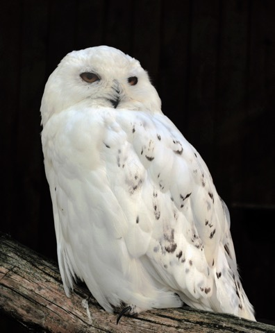

# Snowy Sightings

Photo: [Michael Gäbler](https://commons.wikimedia.org/wiki/User:Michael_G%C3%A4bler), [CC BY-SA 3.0](https://creativecommons.org/licenses/by-sa/3.0/)

CLI tool to check for recent snowy owl observations using the eBird API.

## Setup

    uv sync
    export EBIRD_API_KEY=your-key-here

Get an API key by signing up at https://ebird.org/api/keygen.

For email alerts, set up Gmail SMTP credentials:

    export GMAIL_USER=you@gmail.com
    export GMAIL_APP_PASSWORD=your-app-password

Generate an app password at https://myaccount.google.com/apppasswords (requires 2FA).

## Usage

List recent sightings:

    uv run snowy sightings

Defaults to Salem, MA with a 30-mile radius over the last 14 days. Override with options:

    uv run snowy sightings --lat 40.71 --lng -74.01 --dist 50 --days 30

Check for new sightings and send email alerts:

    uv run snowy check --to "you@gmail.com,spouse@gmail.com"

## eBird API

This tool uses the [eBird API 2.0](https://documenter.getpostman.com/view/664302/S1ENwy59) endpoint `GET /v2/data/obs/geo/recent/{speciesCode}` to fetch recent nearby observations of a species.

### Request Parameters

| Parameter | Description |
|-----------|-------------|
| `lat` | Latitude |
| `lng` | Longitude |
| `dist` | Search radius in km (max 50) |
| `back` | Number of days back to search (max 30) |

Authentication is via the `X-eBirdApiToken` header.

### Response Fields

Each observation is returned as a JSON object with these fields:

| Field | Description |
|-------|-------------|
| `speciesCode` | eBird species code (e.g. `snoowl1`) |
| `comName` | Common name (e.g. "Snowy Owl") |
| `sciName` | Scientific name |
| `locName` | Location name |
| `obsDt` | Observation date and time |
| `howMany` | Number of birds observed |
| `lat` | Latitude of observation |
| `lng` | Longitude of observation |
| `subId` | Checklist submission ID (e.g. `S304358788`) |

Checklist URLs can be constructed as `https://ebird.org/checklist/{subId}`.

## Clearing the Cache

The `check` command stores state in a GitHub Actions cache to avoid duplicate alerts. To reset it and re-send alerts for all current sightings:

    gh cache delete snowy-state

## References

- [eBird API 2.0 Documentation (Postman)](https://documenter.getpostman.com/view/664302/S1ENwy59)
- [eBird API Key Registration](https://ebird.org/api/keygen)
- [eBird API Tutorial - Eric Nost](http://ericnost.github.io/digitalconservation_ebirdapi.html)
- [ebird-api Python Package (PyPI)](https://pypi.org/project/ebird-api/)
- [rebird R Client - Response Field Documentation](https://docs.ropensci.org/rebird/reference/ebirdnotable.html)
- [ProjectBabbler/ebird-api (GitHub)](https://github.com/ProjectBabbler/ebird-api)
